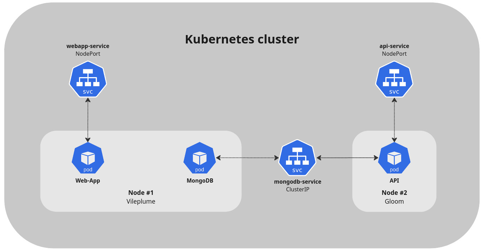

# Backend deployment
This document describes the process to deploy our backend system in our Kubernetes Cluster.

### Table of Contents

- [0) Understanding our Kubernetes Architecture](#0-understanding-our-kubernetes-architecture)
- [1.0) Preparing Cluster to deploy MongoDB](#10-preparing-cluster-to-deploy-mongodb)
  - [1.1) Labeling nodes](#11-labeling-nodes)
  - [1.2) Dockerizing Mongo](#12-dockerizing-mongo)
  - [1.3) Dockerizing API (Backend)](#13-dockerizing-api-backend)
  - [1.4) Persistent Volumes](#14-persistent-volumes)
  - [1.5) ConfigMaps](#15-configmaps)
  - [1.6) Services](#16-services)
- [2.0) MongoDB Deployment](#20-mongodb-deployment)
  - [2.1) Image selection](#21-image-selection)
  - [2.2) Liveness and Readiness Probes](#22-liveness-and-readiness-probes)
  - [2.3) Enviornment variables](#23-enviornment-variables)
  - [2.4) Volumes and Configmap](#24-volumes-and-configmap)
- [3.0) API deployment](#30-api-deployment)
- [Improvements](#improvements)
- [Troubleshooting](#troubleshooting)
- [References](#references)


## 0) Understanding our Kubernetes Architecture
First, we need to understand how the nodes, pods and service are connected and communicate between them.


- **Nodes** (see [installation](./installation.md))

  1. `zubat` (Control Plane)
  2. `vileplume`
  3. `gloom`

- **Deployments**
  1. Web App
  2. MongoDB
  3. API

- **Services**

  | Name              | Exposes     | Type        | Port   |
  |-------------------|-------------|-------------|--------|
  | `webapp-service`  | WebApp      | `NodePort`  | 32333  |
  | `api-service`     | API         | `NodePort`  | 32334  |
  | `mongodb-service` | MongoDB     | `ClusterIP` | -      |

<br>

Summarizing, `NodePort` services expose the `API` and `webapp` deployments to internet to make them accessible, while `mongodb-service` permits communication between `API` and `MongoDB` (unreachable from internet).

## 1.0) Preparing Cluster to deploy MongoDB
In this section we will make the previous steps and configure the cluster before deploying our applications.

### 1.1) Labeling nodes
First, we need to decide if we let Kubernetes choose in which node will our pods be created, or we set a node for certain pods. In this case, we will make this assignment:
| Deployment  | Node        |
|-------------|-------------|
| Web App     | `Vileplume` |
| MongoDB     | `Vileplume` |  
| API         | `Gloom`     | 

To perform that, we need to label our nodes and select them in the **deployment manifests** with tag `nodeSelector`. We will see that later.

For labeling nodes we run:
```bash
kubectl label nodes <your-node-name> <tag>=<name>
```

We will label our nodes this way:
```bash
kubectl label nodes vileplume type=mogoer
kubectl label nodes gloom type=api
```

### 1.2) Dockerizing Mongo
Now we will prepare the images that our deployments will pull. We will use **DockerHub** to upload our images.

Here is the image building for MongoDB deployment. First check the needed files:

- [**init.js**](../manifests/api/docker-image/init.js)
```js
db.createCollection("users");

db.createUser({
  user: "root",
  pwd: "elnano33!",
  roles: ["readWrite"]
});

db.users.insert({
  username: "josep",
  password: "eljefe",
  createdAt: new Date()
});
```

- [**mongo.conf** ](../manifests/api/docker-image/mongo.conf)
```conf
storage:
  dbPath: /data/db

security:
  authorization: enabled

net:
  port: 27017
  bindIp: 0.0.0.0

```

- [**Dockerfile**](../manifests/api/docker-image/Dockerfile)
```Dockerfile
FROM mongo:4.4

COPY mongo.conf /etc/mongo.conf
COPY init.js /docker-entrypoint-initdb.d/

CMD ["mongod", "--config", "/etc/mongo.conf"]
```
The `docker-entrypoint-initdb.d/` directory execute its content automatically when the container is created. Therefore, `init.js` will initialize the database as we want.

To build the image we run:
```bash
docker build -t <repo>/<name>:<tag> Dockerfile
```

To push our images to **DockerHub** we first need to log in and then push the image.
```bash
docker login --username <username> --password <password>
docker push <repo>/<name>:<tag>
```

### 1.3) Dockerizing API (Backend)
In the same way, we will create a Dockerfile to build an image for our backend:
- [**Dockerfile**](../manifests/api/docker-image/Dockerfile)
```Dockerfile
FROM node:slim

ENV NODE_ENV development

WORKDIR /express-docker

COPY . .

RUN npm install

CMD [ "npm", "run", "start" ]

EXPOSE 8080
```
Briefly, we start from a `node` image and then we copy our project into a new directory called `/express-docker`. Then we install all necessary modules. Finally we start up the server and then expose our port.

Again, we build and upload our image to the registry:
```bash
docker build -t <repo>/<name>:<tag> Dockerfile
docker push <repo>/<name>:<tag>
```

### 1.4) Persistent Volumes
To guarantee that our data persists to pod replacing, we will set a persistent volume. Here are the manifests:
- [**mongodb-pv.yaml**](../manifests/mongodb/mongodb-pv.yaml)
```yaml
apiVersion: v1
kind: PersistentVolume
metadata:
  name: mongo-data
spec:
  accessModes:
    - ReadWriteOnce
  capacity:
    storage: 1Gi
  hostPath:
    path: /data/mongo
```
This manifest sets up a Persistence Volume in `/data/mongo` of the node where the pod will be running.

- [**mongodb-pvc.yaml**](../manifests/mongodb/mongodb-pvc.yaml)
```yaml
apiVersion: v1
kind: PersistentVolumeClaim
metadata:
  name: mongodb-pvc
spec:
  storageClassName: ""
  accessModes:
    - ReadWriteOnce 
  volumeName: mongo-data
  resources:
    requests:
      storage: 1Gi
```
And this creates a Persistence Volume Claim. A PVC is a request for storage data in a PV.

### 1.5) ConfigMaps
ConfigMaps are a Kubernetes mechanism that let you inject configuration data into application pods. We need to create one for **MongoDB** deployment to tell the pod from what path it has to store/read data.
```bash
kubectl create configmap create-db-configmap --from-file=./docker-image/init.js
```
By running this, we create a configmap with name `create-db-configmap` with configuration from `init.js`.

### 1.6) Services
As we have established, now we need to expose our pods, so here's the process to start up the needed services.

- [`api-service`](../manifests/api/api-nodeport-svc.yaml)
  ```yaml
  apiVersion: v1
  kind: Service
  metadata:
    name: api-service
  spec:
    type: NodePort
    selector:
      app: zapper-api
    ports:
      - protocol: TCP
        port: 8080
        targetPort: 8080
        nodePort: 32334
  ```
  This manifests sets up a `NodePort` service exposing port `32334` to Internet, routing traffic port 8080 of the api container.

- [`mongodb-service`](../manifests/mongodb/mongodb-clusterip-svc.yaml)
  ```yaml
  apiVersion: v1
  kind: Service
  metadata:
    name: mongodb-service
  spec:
    type: ClusterIP
    selector:
      app: mongo
    ports:
      - protocol: TCP
        port: 27017
        targetPort: 27017
  ```
  In a similar way, we permit the pods with `app: mongo` to be accessible via the default port for Mongod and Mongos instances `27017` within the cluster via a `ClusterIP` service.

## 2.0) MongoDB Deployment
Now we have done all previous steps, it's time to deploy our MongoDB instance. 

An important thing to consider is that we must deploy the MongoDB instance before the API since the API deployment will need to connect to Mongo, so it must be created before.

- [`mongodb-deployment.yaml`](../manifests/mongodb/mongodb-deployment.yaml)
  ```yaml
  apiVersion: apps/v1
  kind: Deployment
  metadata:
    creationTimestamp: null
    labels:
      app: mongo
    name: mongo
  spec:
    replicas: 1
    selector:
      matchLabels:
        app: mongo
    strategy: {}
    template:
      metadata:
        creationTimestamp: null
        labels:
          app: mongo
      spec:
        nodeSelector:
          type: mongoer
        containers:
        - image: mongo:4.4
          name: mongo
          args: ["--dbpath","/data/db", "--auth"]
          livenessProbe:
            exec:
              command:
                - mongo
                - --disableImplicitSessions
                - --eval
                - "db.adminCommand('ping')"
            initialDelaySeconds: 30
            periodSeconds: 10
            timeoutSeconds: 5
            successThreshold: 1
            failureThreshold: 6
          readinessProbe:
            exec:
              command:
                - mongo
                - --disableImplicitSessions
                - --eval
                - "db.adminCommand('ping')"
            initialDelaySeconds: 30
            periodSeconds: 10
            timeoutSeconds: 5
            successThreshold: 1
            failureThreshold: 6
          env:
          - name: MONGO_INITDB_DATABASE
            value: "zapper"
          - name: MONGO_INITDB_ROOT_USERNAME
            value: "root"
          - name: MONGO_INITDB_ROOT_PASSWORD
            value: <password>
          volumeMounts:
          - name: "mongo-data-dir"
            mountPath: "/data/db"
          - name: "init-database"
            mountPath: "/docker-entrypoint-initdb.d/"
        volumes:
        - name: "mongo-data-dir"
          persistentVolumeClaim:
            claimName: "mongodb-pvc"
        - name: "init-database"
          configMap:
            name: create-db-configmap
  ```

  Let's understand what does every section of this manifest.

### 2.1) Image selection
```yaml
spec:
      nodeSelector:
        type: mongoer
      containers:
      - image: mongo:4.4
        name: mongo
        args: ["--dbpath","/data/db", "--auth"]
```
- First we select the image of mongo version `4.4`, see [Troubleshooting](#troubleshooting).

- With `nodeSelector` we are telling Kubernetes that we want to deploy that/these pods in a specific node with label `type: mongoer`. As we mentioned before in [Labeling nodes](#11-labeling-nodes), mongo will be deployed in `Vileplume`.

- Then we establish the path in which data will be located: `--dbpath /data/db` and enabling authorization `-auth`.

### 2.2) Liveness and Readiness Probes
Readiness probes and liveness probes in are both mechanisms used to ensure the reliability and availability of containers in a pod, and both check the container periodically after the container starts. 
- **Liveness probes** are used to determine whether a container is still running and functioning correctly.

  They check if the container is alive and responsive and are used to detect and recover from situations where a container becomes unresponsive or gets stuck in an error state.

- **Readiness probes** are used to determine whether a container is ready to accept incoming traffic. They check if the container is in a state where it can safely handle requests.

#### Liveness probe
```yaml
livenessProbe:
          exec:
            command:
              - mongo
              - --disableImplicitSessions
              - --eval
              - "db.adminCommand('ping')"
          initialDelaySeconds: 30
          periodSeconds: 10
          timeoutSeconds: 5
          successThreshold: 1
          failureThreshold: 6
```
  - Briefly, we perform a `ping` command to ensure that our pod is alive.

#### Readiness probe
```yaml
readinessProbe:
          exec:
            command:
              - mongo
              - --disableImplicitSessions
              - --eval
              - "db.adminCommand('ping')"
          initialDelaySeconds: 30
          periodSeconds: 10
          timeoutSeconds: 5
          successThreshold: 1
          failureThreshold: 6
```
- Same for readiness probe.

### 2.3) Enviornment variables
MongoDB images looks for specific enviornment variables and configures its service with its values. Some of these variables are:
- `MONGO_INITDB_DATABASE`: name of the initial database.
- `MONGO_INITDB_ROOT_USERNAME`: name of root user with `admin` role of **admin database**.
- `MONGO_INITDB_ROOT_PASSWORD`: password of root user.

```yaml
 env:
  - name: MONGO_INITDB_DATABASE
    value: "zapper"
  - name: MONGO_INITDB_ROOT_USERNAME
    value: "root"
  - name: MONGO_INITDB_ROOT_PASSWORD
    value: <password>
```

### 2.4) Volumes and Configmap
Finally we set up the volumes with our Persistence Volume (PV) and Peristence Volume Claims (PVC) configuration.
```yaml
env:
  volumeMounts:
    - name: "mongo-data-dir"
      mountPath: "/data/db"
    - name: "init-database"
      mountPath: "/docker-entrypoint-initdb.d/"
volumes:
- name: "mongo-data-dir"
  persistentVolumeClaim:
    claimName: "mongodb-pvc"
```

## 3.0) API deployment
The last step is to deploy our API deployment to process requests and answer the frontend.
Check out the manifest `api-deployment.yaml`:
```yaml
apiVersion: apps/v1
kind: Deployment
metadata:
  name: api-deployment
spec:
  replicas: 1
  selector:
    matchLabels:
      app: zapper-api
  template:
    metadata:
      labels:
        app: zapper-api
    spec:
      nodeSelector:
        type: api
      containers:
      - name: api-container
        image: masep01/zapper-api:latest
        ports:
        - containerPort: 8080
      imagePullSecrets:
      - name: registry-secret
```
As we can see, the deployment pulls `zapper-api` image, and exposes port `8080` since the application accepts requests locally in port `8080`.

## Improvements
See [Ingress Controller](./ingress.md)

## Troubleshooting
### Mongo 4.4
We have found that Mongo versions <= `5.0` are incompatible with our machines due to CPU instructions issues, so the solution was to perform a downgrade to version `4.4`.

The problem was that our CPUs did not have AVX instructions, which are used from Mongo `5.0` to up.

See more information here: 
- [Stack OverFlow](https://stackoverflow.com/questions/70818543/mongo-db-deployment-not-working-in-kubernetes-because-processor-doesnt-have-avx)
- [Github issues (1)](https://github.com/wekan/wekan/issues/4321)
- [Github issues (2)](https://github.com/turnkeylinux/tracker/issues/1724)

## References 
- [Assign pods to nodes](https://kubernetes.io/docs/tasks/configure-pod-container/assign-pods-nodes/)
- [Miro App](https://miro.com)
- [Kubernetes readiness probes](https://spacelift.io/blog/kubernetes-readiness-probe)