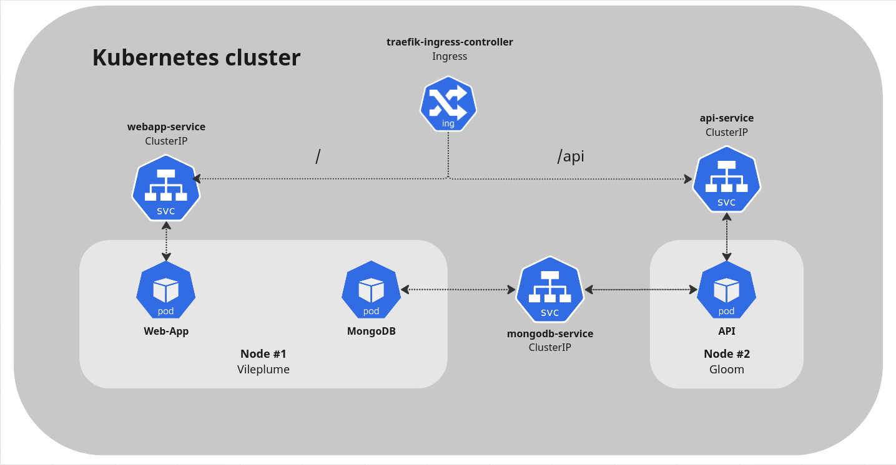

# Ingress Controller Configuration
As a final improvement, we want to set up the next features:
- HTTPS communication
- Path-based routing
- Proxy manager

So we need to use an **Ingress Controller Manager**.

## What is Ingress?
>Ingress exposes HTTP and HTTPS routes from outside the cluster to services within the cluster. Traffic routing is controlled by rules defined on the Ingress resource.

> In order for the Ingress resource to work, the cluster must have an ingress controller running. 

We will be using `Traefik Ingress Controller`, which is installed by default in `k3s` enviornments.

In other words, now our `NodePort` services will disappear and `Ingress` will recieve all traffic and it will be routed based on previous defined rules. 

Translated to our cluster, we need to perform 2 changes:
1) `api-service` and `webapp-services` will be now `ClusterIP` services instead of `NodePort`, since we don't want them to be accessible via the defined ports (32333 and 32334).  
Now, all traffic will be sent to port 443 (HTTPS).

2) Deploy `Ingress Controller` and configure it to send traffic to the previous services.

## New architecture
As explained above, Ingress will route traffic based on path rules. 
| Path           | Service           | Internal port |
|----------------|-------------------|---------------|
| `/`            | `webapp-service`  | 3000          |
| `/api`         | `api-service`     | 8080          |

**Architecture**



## Ingress configuration
We will use [**Traefik**](https://doc.traefik.io/traefik/providers/kubernetes-ingress/) as our Ingress Controller.

Next, generate a self-signed certificate for our HTTPS connections.
1) Generate the private key.
    ```bash
    openssl genrsa -out cert.key 2048
    ```
2) Generate the signature request.
    ```bash
    openssl req -new -key cert.key -out cert.csr
    ```
3) Generate the self-signed certificate.
    ```bash
    openssl x509 -req -days 365 -in cert.csr -signkey cert.key -out cert.crt
    ```

Now we need to create a secret with the self-signed certificate and server private key.
```bash
kubectl create secret tls zubat-tls-secret --cert=cert.crt --key=cert.key
```

Finally configure Ingress Resources and enable TLS.

- [ingress-resources.yaml](../manifests/ingress/ingress-resources.yaml)
```yaml
apiVersion: networking.k8s.io/v1
kind: Ingress
metadata:
  name: zubat-ingress
spec:
  tls:
  - hosts:
    - gloom.fib.upc.edu
    secretName: zubat-tls-secret
  rules:
  - host: gloom.fib.upc.edu
    http:
      paths:
      - path: /api
        pathType: Prefix
        backend:
          service:
            name: api-service
            port:
              number: 8080
      - path: /
        pathType: Prefix
        backend:
          service:
            name: webapp-service
            port:
              number: 3000
```
As we can see, rules set a path-based routing policy, redirecting traffic from `/` to `webapp-service` on port `3000`, and traffic from `/api` to `api-service` on port `8080`.

## Results
Now, access to:
-  Webapp: http://zubat.fib.upc.edu:32333
-  API: http://zubat.fib.upc.edu:32334

Is no longer permitted.

A unique hostname:port [gloom.fib.upc.edu:443] is reponsible for handling all traffic:
-  Webapp: https://gloom.fib.upc.edu/
-  API: https://gloom.fib.upc.edu/api

Connection is ciphered by HTTPS.

**Disclaimer**  
Browser will warn you that connection is not secure due to the self-signed certificate used. To solve that, we can use [Let's Encrypt](https://letsencrypt.org/) in order to sign the certificate by a CA trusted by almost all browsers.

In our case, as all our machines are behind the UPC's VPN, we cannot do that. So we will ignore that warning.

## References
[Ingress - Kubernetes](https://kubernetes.io/docs/concepts/services-networking/ingress/)

[NGINX Ingress Controller - Documentation](https://kubernetes.github.io/ingress-nginx/)
