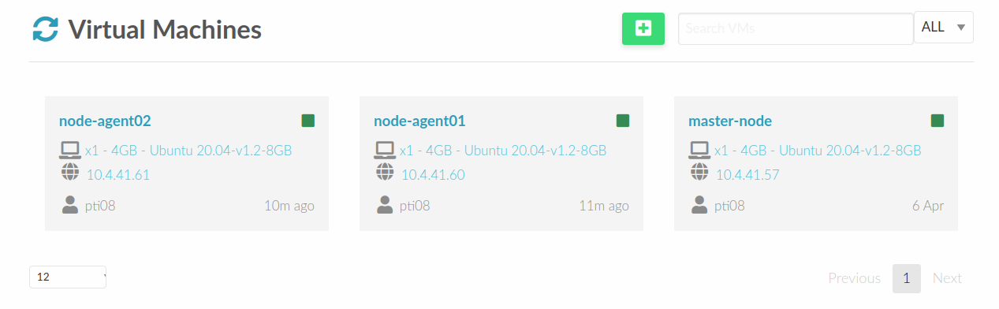

# Cluster setup
**Assets:**
| id             | hostname               | ip         |
|----------------|------------------------|------------|
| `master-node`  | zubat.fib.upc.edu      | 10.4.41.57 |
| `node-agent01` | gloom.fib.upc.edu      | 10.4.41.60 |
| `node-agent02` | vileplume.fib.upc.edu  | 10.4.41.61 |



## node-master
### First steps
First, in order to update all packages and install basic dependencies we run:
```bash
alumne@zubat:~$ sudo apt-get update
alumne@zubat:~$ sudo apt-get install build-essential
```

Then it is time to install `docker` and `k3s`:
```bash
alumne@zubat:~$ sudo apt-get install docker.io
alumne@zubat:~$ curl -sfL https://get.k3s.io | sh -
```

Additional utilities will be installed, including `kubectl`, `crictl`, `ctr`, `k3s-killall.sh`, and `k3s-uninstall.sh` when installing `k3s`.

For convenience we will configure our master node via ssh from now and then:
```bash
ssh alumne@10.4.41.57
```

As we can see, `k3s cluster` is up:
```bash
alumne@zubat:~$ sudo kubectl get nodes
NAME    STATUS   ROLES                  AGE   VERSION
zubat   Ready    control-plane,master   36m   v1.28.8+k3s1
```

### Set up k3s server
We need to set up a k3s server to connect the other agents (2) to the cluster.
To do that, we first need:
1. `K3S_TOKEN`, a required value to register agents to k3s server.
2. `K3S_URL` is the server, which in this case will be the `node-master`'s IP `10.4.41.57`:
```bash
alumne@zubat:~$ sudo cat /var/lib/rancher/k3s/server/node-token
K10eccb40bcc7cacf16dc54a9daf032c299692fbd48dfb2782644bad4356343a56e::server:9362565a5a349b3b49d8ab386b102226
```

Then we run in each agent node:
```bash
alumne@zubat:~$ curl -sfL https://get.k3s.io | K3S_URL=https://10.4.41.57:6443 K3S_TOKEN=K10eccb40bcc7cacf16dc54a9daf032c299692fbd48dfb2782644bad4356343a56e::server:9362565a5a349b3b49d8ab386b102226 sh -
```

We can verify in our `master-node` that the agents were successfully added to our cluster! Yeeehah!
```bash
alumne@zubat:~$ sudo kubectl get nodes
NAME        STATUS   ROLES                  AGE     VERSION
zubat       Ready    control-plane,master   56m     v1.28.8+k3s1
gloom       Ready    <none>                 3m52s   v1.28.8+k3s1
vileplume   Ready    <none>                 44s     v1.28.8+k3s1
```

### Links
- [k3s documentation](https://docs.k3s.io)